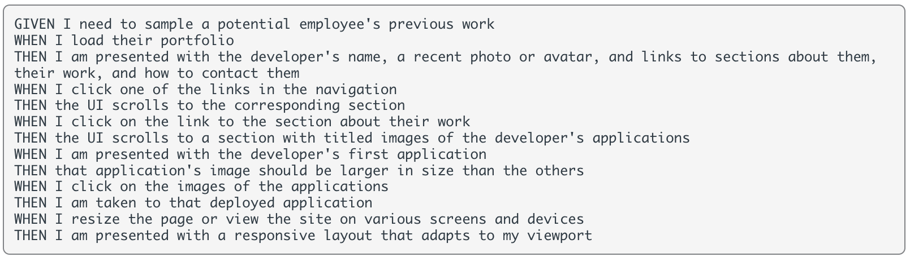
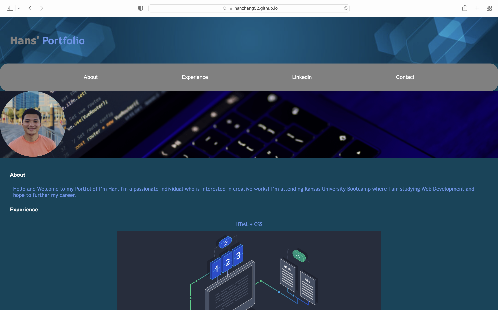
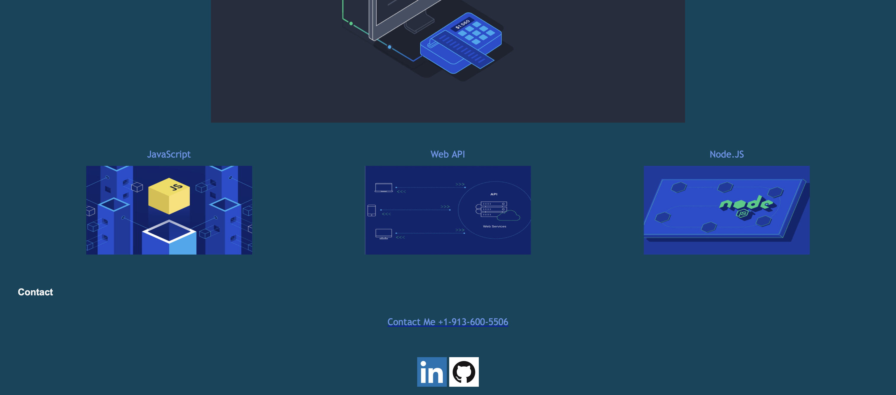

# My Portfolio

My Professional Portfolio

For this week’s challenge, I challenged myself to create a professional portfolio using what I learned and applied it to my webpage using HTML and CSS from scratch. This is an ongoing webpage that I will be adding over time.

The webpage is in sections that include an about, which contains a brief summary of me, a couple of experiences that I will be learning throughout the Bootcamp, my Linkedin profile, and a way to contact me while keeping in mind of the following requirements:

I have placed a couple of non-placeholder applications that will take the user to the deployed application on my Linkedin and GitHub profile when clicked on.

I have also included some hover effects for various projects on the page.

The webpage was styled for multiple screen sizes, which is suitable for 4k ultrawide displays, laptops, tablets and mobile smartphones.

## ScreenShot

## Link to deployed application:

https://hanzhang52.github.io/my-portfolio/

## License

MIT License

Copyright (c) [2022] [Han Zhang]

Permission is hereby granted, free of charge, to any person obtaining a copy
of this software and associated documentation files (the "Software"), to deal
in the Software without restriction, including without limitation the rights
to use, copy, modify, merge, publish, distribute, sublicense, and/or sell
copies of the Software, and to permit persons to whom the Software is
furnished to do so, subject to the following conditions:

The above copyright notice and this permission notice shall be included in all
copies or substantial portions of the Software.

THE SOFTWARE IS PROVIDED "AS IS", WITHOUT WARRANTY OF ANY KIND, EXPRESS OR
IMPLIED, INCLUDING BUT NOT LIMITED TO THE WARRANTIES OF MERCHANTABILITY,
FITNESS FOR A PARTICULAR PURPOSE AND NONINFRINGEMENT. IN NO EVENT SHALL THE
AUTHORS OR COPYRIGHT HOLDERS BE LIABLE FOR ANY CLAIM, DAMAGES OR OTHER
LIABILITY, WHETHER IN AN ACTION OF CONTRACT, TORT OR OTHERWISE, ARISING FROM,
OUT OF OR IN CONNECTION WITH THE SOFTWARE OR THE USE OR OTHER DEALINGS IN THE
SOFTWARE.
